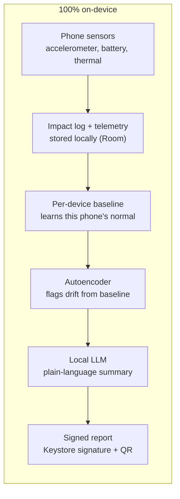

# PhonePulse

**On-device AI health record for your phone.** An Android app that logs drops, learns what is normal for *your* phone, flags unusual behavior, explains it in plain language, and produces a signed report a used-phone buyer can verify. Everything runs on the phone. Nothing is sent to a server.

Built for the iQOO Hackathon 2026 (Open Innovation track).

> **Project status:** the ML pipeline is built and runs. The Android app is in progress. See [Status](#status) for exactly what works today and what is planned.

---

## Table of contents

1. [Problem](#problem)
2. [Solution](#solution)
3. [Status](#status)
4. [How it works](#how-it-works)
5. [Features](#features)
6. [The anomaly model](#the-anomaly-model)
7. [Tech stack](#tech-stack)
8. [Running on the Snapdragon NPU](#running-on-the-snapdragon-npu)
9. [Repository structure](#repository-structure)
10. [Getting started](#getting-started)
11. [Limitations](#limitations)
12. [Existing solutions and gaps](#existing-solutions-and-gaps)
13. [Roadmap](#roadmap)
14. [Pre-existing components and originality](#pre-existing-components-and-originality)
15. [License](#license)

---

## Problem

- Drops, heat, and battery stress degrade phones gradually, and most of the damage is not visible.
- Used-phone buyers in India have only the seller's word and a quick check of the screen.
- Existing apps show a snapshot (battery percentage, a one-time test) and keep no history of what happened to the phone.

## Solution

PhonePulse keeps a health record of the phone, fully on-device.

- **Impact log:** detects a drop (free-fall, then an impact spike) and records the time and relative severity.
- **Per-device baseline:** learns this phone's normal battery temperature, drain, voltage sag, and sensor noise.
- **Anomaly flag:** an autoencoder flags drift away from that baseline.
- **Explanation:** a small local LLM turns the findings into a plain-language summary.
- **Buyer mode:** a 90-second active scan of battery, thermals, sensors, speaker/mic, and charging.
- **Signed report:** signed with the Android Keystore and verifiable via QR code.

**Wording matters.** The app says *"unusual behavior detected, get it inspected."* It never claims confirmed damage, because a phone cannot see inside itself.

## PhonePulse: User Flow

```mermaid
flowchart LR
    A([Install and open PhonePulse]) --> B[Grant sensor and battery permissions]
    B --> C[Learn per-device baseline]
    C --> D{Choose mode}

    D -->|Owner| E[Background monitoring<br/>Foreground service + WorkManager]
    E --> F[Impact log<br/>free-fall then spike]
    E --> G[Battery, thermal and sensor readings]

    D -->|Buyer| L[90-second active scan<br/>battery, thermals, sensors, speaker/mic, charging]

    F --> H[Autoencoder checks drift from baseline]
    G --> H
    L --> H

    H --> I{Anomaly?}
    I -->|No| J[Device Health: Good]
    I -->|Yes| K[Local LLM plain-language explanation<br/>with confidence level]
    K --> Q[Get it inspected]

    J --> M[Signed report<br/>Android Keystore]
    Q --> M
    M --> N([Buyer verifies via QR code])

    classDef start fill:#19B394,stroke:#0E8A6B,color:#fff;
    classDef step fill:#E3F5EE,stroke:#0E8A6B,color:#0C1B3A;
    classDef decision fill:#FDF0E0,stroke:#F59E0B,color:#0C1B3A;
    classDef warn fill:#FDECEE,stroke:#E85D6A,color:#0C1B3A;
    class A,N start;
    class B,C,E,F,G,L,H,J,M step;
    class D,I decision;
    class K,Q warn;
```


## Status

| Component | State | Notes |
|---|---|---|
| Anomaly model: synthetic data generator, training, evaluation | Done | `ml/` |
| TFLite export (float32 and int8) | Done | Both files load and run |
| Per-device baseline normalization | Done (in the ML pipeline) | On-device calibration logic still to be written in Kotlin |
| Android app: impact detector, telemetry logger, dashboard | Planned | |
| NPU inference via LiteRT `CompiledModel` | Planned, untested | Needs the target Snapdragon phone |
| Local LLM summary (LiteRT-LM) | Planned, untested | Templated-text fallback comes first |
| Buyer-mode active scan | Planned | |
| Signed report and QR code | Planned | |
| Training on real telemetry | Planned | Current model is trained on synthetic data only |

## How it works



**Owner mode** runs continuously: it logs every drop, learns the phone's normal behavior, and flags unusual drift over time.

**Buyer mode** is a one-off 90-second active scan (battery, thermals, sensors, speaker/mic, charging) for a phone the user is thinking of buying. With no history to learn from, it compares against a population baseline and reports lower confidence.

## Features

| Feature | What it does |
|---|---|
| Impact log | Free-fall followed by an impact spike is recorded with time and relative severity. Severity is relative because phone accelerometers saturate at roughly 8 to 16 g. |
| Per-device baseline | The first 40 telemetry windows are used to compute this phone's own mean and standard deviation for each feature. |
| Anomaly flag | An autoencoder reconstructs each window. High reconstruction error means unusual behavior. |
| Explanation | A small open-source LLM (1 to 3B parameters) turns structured findings into a short summary. It explains only. The flag itself comes from the model and threshold. |
| Buyer mode | Active scan with confidence levels on each finding. |
| Signed report | Report signed with a key in the Android Keystore. The QR code carries the signature and a hash so the report can be checked for edits. Note this proves the report was not altered, not that the phone is healthy. |
| Voice | On-device Android TextToSpeech can read the verdict aloud. |

## The anomaly model

**Input:** 8 features per telemetry window.

| # | Feature | Source (Android) |
|---|---|---|
| 1 | Idle battery temperature | `BatteryManager` |
| 2 | Charging heat rise over 10 minutes | `BatteryManager` |
| 3 | Idle drain (% per hour) | `BatteryManager` |
| 4 | Voltage sag under CPU load | `BatteryManager` plus a load test |
| 5 | Charging current | `BatteryManager` |
| 6 | Accelerometer noise (phone stationary) | `SensorManager` |
| 7 | Gyroscope bias (phone stationary) | `SensorManager` |
| 8 | Thermal headroom | `PowerManager` |

**Per-device normalization.** During calibration the app records the first 40 windows, stores their mean and standard deviation, and feeds z-scores to the model. Every later window is measured against *this phone's own normal*, so a single model file works across devices.

**Architecture.** A small dense autoencoder: 8 → 16 → 4 → 16 → 8, ReLU activations, MSE loss. Trained on healthy behavior only.

**Alert rule.** A window is flagged when its reconstruction error exceeds the 99th percentile of error on healthy validation data. The threshold is saved in `model_meta.json`.

**Results on synthetic data.** The simulator injects three fault types (impact damage, battery stress, charging fault).

| Metric | Value |
|---|---|
| AUROC | 0.999 |
| Detection rate (TPR) | 98.9% |
| False alarm rate (FPR) | 1.2% |

> **Read this before quoting these numbers.** They describe how well the model separates the *simulator's* faults from the simulator's healthy data. They are not evidence of real-world damage detection. Real accuracy is unknown until the model is trained and tested on telemetry from real phones.

**Exports.** `model.tflite` (float32) and `model_int8.tflite` (quantized, the better fit for NPU delegates). In testing, int8 reconstruction errors correlate 0.94 with float32, so quantization is usable but lossy. Re-check the threshold on-device.

## Tech stack

| Layer | Tools |
|---|---|
| App | Kotlin, Jetpack Compose |
| Data sources | `SensorManager`, `BatteryManager`, `PowerManager` thermal APIs, `AudioRecord` (`UNPROCESSED` source) |
| Background | Foreground service, WorkManager |
| Storage | Room |
| Model | TensorFlow/Keras autoencoder (8 features), exported as float32 and int8 TFLite |
| Runtime | LiteRT `CompiledModel` with the Qualcomm NPU accelerator, falling back to GPU then CPU |
| LLM | Small open-source model (1 to 3B) via LiteRT-LM, with a templated-text fallback |
| Trust | Android Keystore signing, QR code |
| Voice | On-device Android TextToSpeech |

## Running on the Snapdragon NPU

Planned approach:

1. Load `model_int8.tflite` through LiteRT's `CompiledModel` API and request the Qualcomm NPU accelerator.
2. Use on-device compilation first (no SoC-specific build step).
3. Fall back NPU, then GPU, then CPU, so the app works on any phone.
4. Show the active accelerator in the UI and display CPU vs NPU latency for the same model.

A model this small will not necessarily run faster on the NPU, because call overhead can dominate. The measured latency on screen is what counts, and no speedup is claimed until it is measured. The NPU is expected to matter most for the LLM.

## Repository structure

```
phonepulse/
├── README.md
├── LICENSE
├── ml/                          # built
│   ├── synthetic_data.py        # simulator + per-device normalization
│   ├── train_autoencoder.py     # train, evaluate, export
│   ├── model.tflite             # float32 model
│   ├── model_int8.tflite        # quantized model
│   ├── model_meta.json          # feature order, threshold, calibration settings
│   ├── requirements.txt
│   └── README.md
└── app/                         # planned: Android (Kotlin + Compose)
    ├── sensors/                 # impact detector
    ├── battery/                 # battery + thermal telemetry
    ├── data/                    # Room database
    ├── ml/                      # LiteRT loader, delegate fallback
    └── ui/                      # dashboard, impact timeline, report
```

## Getting started

Train the model and regenerate the exports (Python 3.10+):

```bash
cd ml
pip install -r requirements.txt
python train_autoencoder.py
```

This writes `model.tflite`, `model_int8.tflite`, and `model_meta.json`, and prints AUROC, detection rate, false alarm rate, and the alert threshold.

Android build instructions will be added once the app code is in the repo.

## Limitations

- **Synthetic training data.** Reported metrics come from a simulator. Real telemetry is required before any accuracy claim.
- **Symptoms, not causes.** Phones cannot sense cracked boards or a physically swelling battery. The app can only notice behavior that changes. Each finding carries a confidence level.
- **Accelerometer range.** Sensors saturate at roughly 8 to 16 g, so impacts are logged as relative severity, not true g-force.
- **Stationary-only sensor checks.** Gyroscope and accelerometer noise are measured only while the phone is still, otherwise movement would look like a fault.
- **Vendor differences.** Some phones do not expose battery temperature or cycle count reliably, and some vendors aggressively kill background services, which affects continuous impact logging. Android 14+ requires a declared foreground service type.
- **Report scope.** A signed report proves it was not edited after creation. It does not prove the phone is in good condition, and a seller could scan under favorable conditions, so scan conditions should be shown in the report.
- **Untested on target hardware.** NPU and LLM execution are not yet verified.

## Existing solutions and gaps

| Existing solution | Gap | What PhonePulse adds |
|---|---|---|
| AccuBattery, OEM battery health | Battery only | Battery plus impact and thermal correlation |
| Phone Doctor Plus, Phone Check | One-time tests, no history, unverifiable | Continuous log, signed report |
| CPU-Z, Device Info HW | Raw numbers, no interpretation | Baseline and plain-language explanation |
| Samsung Members, OEM care apps | Brand-locked | Works across Android brands |

Gaps addressed: no event history, no per-phone baseline, no explanation, no verifiable report.

*This comparison is based on general knowledge of these apps, not an exhaustive store review.*

## Roadmap

- [x] Synthetic data generator and per-device normalization
- [x] Autoencoder training and evaluation
- [x] TFLite export (float32 and int8)
- [ ] Impact detector (free-fall then spike, relative severity)
- [ ] Battery and thermal telemetry logger with Room storage
- [ ] On-device calibration and anomaly inference (CPU first)
- [ ] NPU delegate with GPU/CPU fallback, CPU vs NPU benchmark screen
- [ ] Buyer-mode 90-second scan
- [ ] Local LLM summary with templated fallback
- [ ] Signed report and QR verification
- [ ] Collect real telemetry (including scripted drop tests on spare phones) and retrain
- [ ] Optional: speaker/mic frequency-response check

## Pre-existing components and originality

The project idea, the simulator, the training pipeline, and the app logic are our own work. We rely on these open-source components and platform APIs:

- TensorFlow/Keras, NumPy, scikit-learn (training and evaluation)
- LiteRT and LiteRT-LM (on-device inference)
- Android platform APIs, Jetpack Compose, Room, WorkManager, Android Keystore
- A small open-source LLM for the explanation step (model to be chosen from what LiteRT-LM supports)
- A QR code library for the signed report

## License

MIT. See `LICENSE`.
